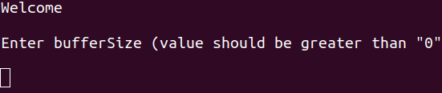
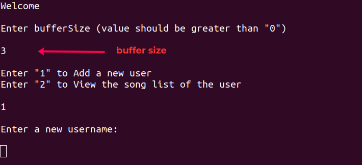
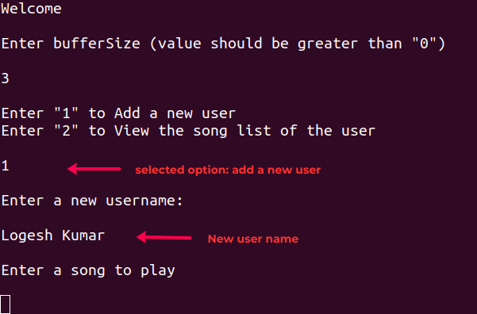
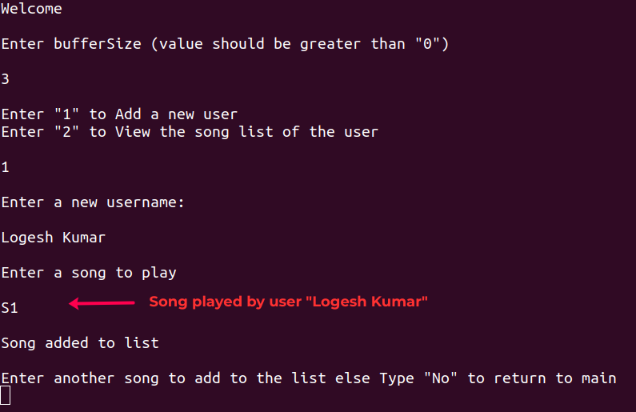
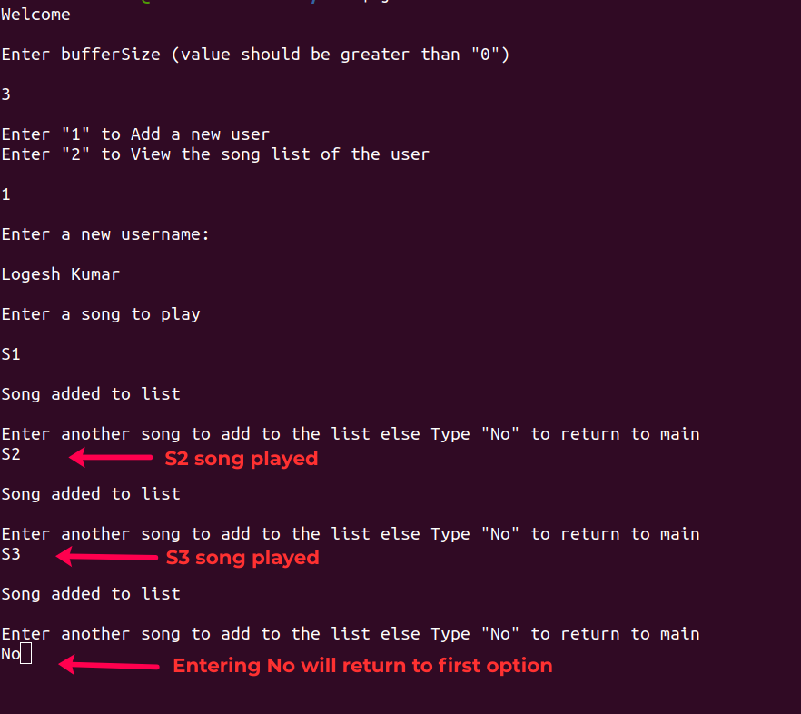
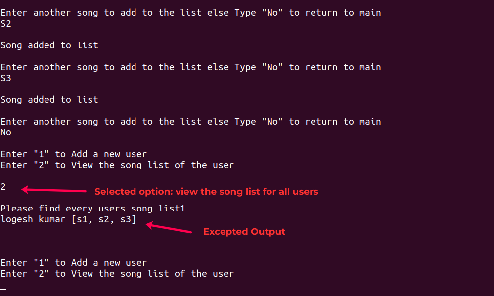
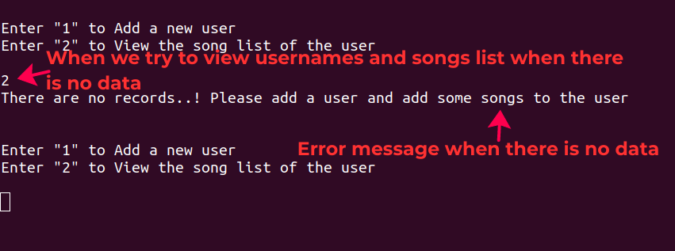
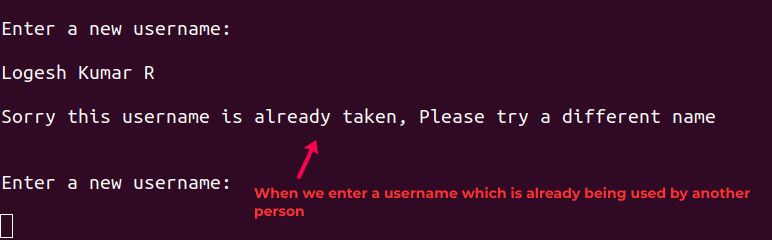

# logesh

# In-Memory Recently Played songs

# Introduction
The Program creates a fixed buffer size to store each user's recently played songs, and if the recently played songs list reaches the buffer limit, the oldest song in the queue will be removed when a new song is added.

# How to Use
1. Ensure Java is installed in your machiene
2. Download the `Main.java` files to your local machine and open terminal from the path where Main.java is present.
3. Compile the `Main.java` file using the below commands  
    --> javac Main.java  
    --> java Main

# Features
<b>Buffer Size:</b> The buffer size determines how many songs a user can have in their recently played songs list.

<b>Add New User:</b> Users can create a new account by providing a unique username. Duplicate usernames are not allowed.

<b>Add Songs to play:</b> When user plays a song if the recently played songs list reaches its buffer size, the oldest song will be removed when a new song is played.

<b>View song list:</b> The recently played songs of all user's can be viewed

# How It Works
When the program starts, it prompts the user to set the buffer size. The buffer size determines the maximum number of recently played songs can be stored for every user.

Then we can choose to perform one of the following actions:

<b>Add a new user:</b> The program prompts the user to provide a unique username. If the username is available, a new user is created, and the user can add songs to listen.  
<b>View song list of the user:</b> The system displays the recently played songs of each user along with their respective username.

If the recently played songs list reaches the buffer size, the oldest song will be automatically removed to make space for the new song.

# Notes
The program uses a simple in-memory data structure (ArrayList, HashMap) to store user details and recently played songs list. Any data added during the program's runtime will be lost once the program terminates.

The program uses a HashMap to store user details, where the username is the key, and the User object (containing the user's name and songList) is the value.

To ensure the program runs correctly, follow the above instructions and provide valid inputs.

## Sample output images
#### 1. Getting buffer size

#### 2. Getting username after Entering '1'

#### 3. Getting username and then song to play for user

#### 4. Song S1' added for user and asking whether more songs need to be added

#### 5. Once songs are added for user, Enter 'No' to go main

#### 6. Getting username and their recently played songs list (last element of the list is the most recently played song of the user)

## Sample output images for invalid input cases

#### 1. We show this error message when no user have been created but trying to view all usernames and song list

#### 2. When a username is not available

